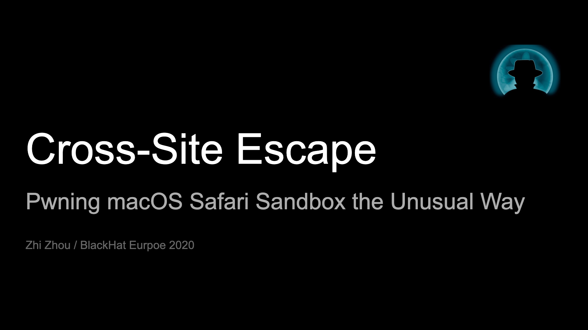

# slides

## [Hack Different: Pwning iOS 14 with Generation Z Bugz (BlackHat USA 2021)](https://www.blackhat.com/us-21/briefings/schedule/#hack-different-pwning-ios--with-generation-z-bugz-23002)

<small>Zhi Zhou(@CodeColorist), Jundong Xie (@Jdddong)</small>

[paper](https://i.blackhat.com/USA21/Wednesday-Handouts/us-21-Hack-Different-Pwning-IOS-14-With-Generation-Z-Bug-wp.pdf)
[recording](https://www.youtube.com/watch?v=fLXc5PJdtp0)
[parody](https://codecolor.ist/mistune/)

---

## See No Eval: Runtime Dynamic Code Execution in Objective-C (RWCTF 2021)

<small>Zhi Zhou(@CodeColorist)</small>

---

## [Cross-Site Escape: Pwning macOS Safari Sandbox the Unusual Way (BlackHat EU 2020)](https://www.blackhat.com/eu-20/briefings/schedule/#cross-site-escape-pwning-macos-safari-sandbox-the-unusual-way-21133)

<small>Zhi Zhou(@CodeColorist)</small>

---

## I Want to Break Free: Unusuall Logic Safari Sandbox Escapes (TyphoonCon 2019)

<small>Zhi Zhou(@CodeColorist)</small>

---

## [ModJack: Hijacking the macOS Kernel (HITB Ams 2019)](https://archive.conference.hitb.org/hitbsecconf2019ams/sessions/modjack-hijacking-the-macos-kernel/)

<small>Zhi Zhou(@CodeColorist)</small>

[recording](https://www.youtube.com/watch?v=OVT1DrSiLWQ)

---

## [Many Birds, One Stone: Exploiting a Single SQLite Vulnerability Across Multiple Software (BlackHat USA 2017)](https://www.blackhat.com/us-17/briefings/schedule/#many-birds-one-stone-exploiting-a-single-sqlite-vulnerability-across-multiple-software-7024)

<small>Siji Feng(a.k.a slipper), Zhi Zhou(@CodeColorist), Kun Yang(@KelwinYang).  
Chaitin Security Research Lab(@ChaitinTech)</small>

[recording](https://www.youtube.com/watch?v=Kqv8S1BQYwE)

---